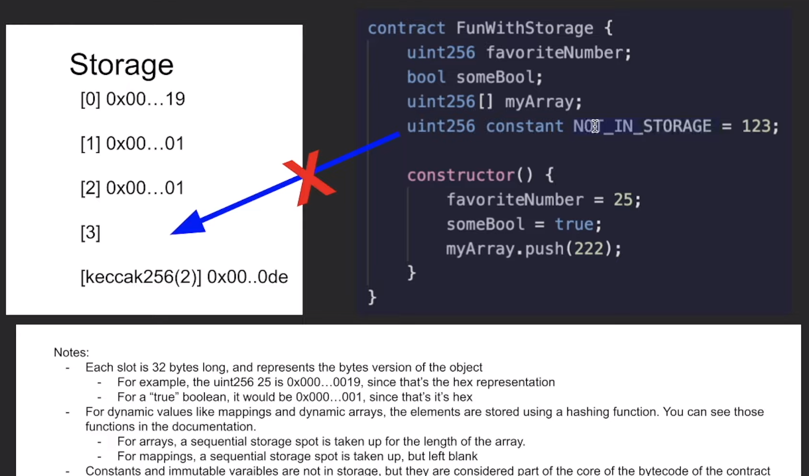

Use the below to find out the gas used for a certain function:
```Solidity
forge snapshot --match-test <name_of_function>
```
The result will then be output to a file named .gas-snapshot
When working with Anvil fork, the gas defaults to 0.



Lessons learned:
- Use state (global) variables to save on gas
- For dynamic variable that can change length like mapping and dynamic functions, elements are stored using a hashing function.
For array, the length of the array is stored in one sequential slot of Storage (see image above).
- Constants and immutable variables are stored in the contract bytecode, not in storage.
- String is technically dynamically-sized array, hence requiring either the "memory" (temporary and will be wiped after function) or "storage" (will persist) keyword when used as function parameter.
- **Reading and writing from storage is expensive computation gaswise** SLOAD (load a word from storage) and STORE (store a value into storage) cost 100 gas each.
- MLOAD and MSTORE is much more efficient at 3 gas each.

Code to inspect storage layout of a contract:
```Solidity
forge inspect <contract_name> storageLayout
```

This website, https://evm.codes, will show the opcodes (primitive operations) gas cost. E.g. ADD costs 3 gas, but MUL costs 5 gas.
I can add in extension "Solidity Visual Developer" if needed to help identify storage variable and other types of variables.

Chainlink style guide: https://github.com/smartcontractkit/chainlink/blob/develop/contracts/STYLE.md
